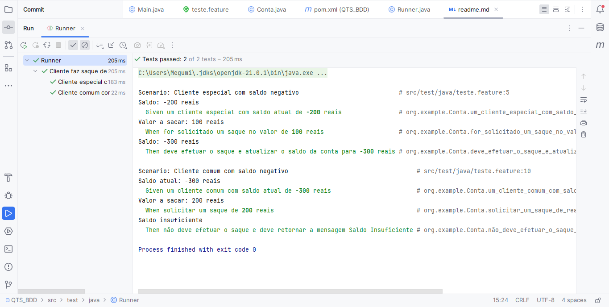

# [QTS] BDD - Conta bancária

### Parte 1 - Implementação do cenário de teste:

Assim que executar run no cenário, ele mesmo dará sugestões de métodos a serem implementados, os quais foram inseridos na classe 'Conta.java'.

### Parte 2 - Cliente Comum (1/2):
Implementação dos métodos sugeridos na 'Conta.java' destinado ao cliente comum.

### Parte 3 - Cliente Comum (2/2):
Execução do teste após a inserção do código na 'Conta.java':

### Parte 4 - Cliente Especial (1/2):
Implementação dos métodos sugeridos na 'Conta.java' destinado ao cliente especial.

### Parte 5 - Cliente Especial (2/2):
Execução do teste após a inserção do código na 'Conta.java':

### Parte 6 - Runner:
A inserção do Runner serve para que haja a execução do Cucumber com Junit.

